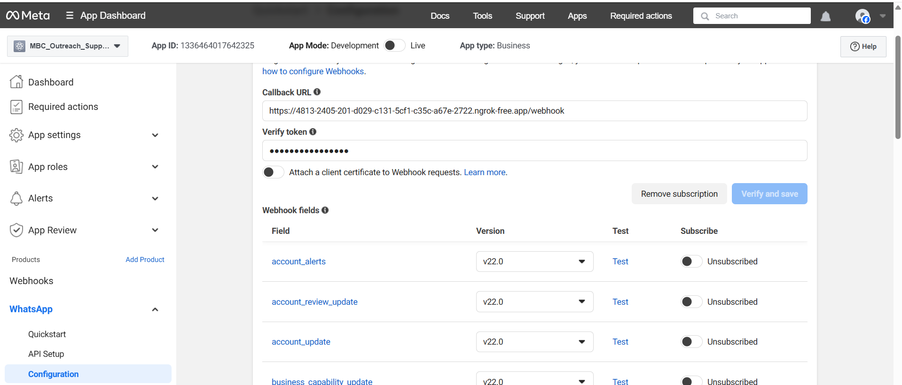

### Sample UI Screenshot

This screenshot shows the main interface of the application, demonstrating its key features and layout.

---

### SETUP

A demo app was created on the Meta Business platform.

The webhook was onboarded to the application to build a conversational workflow.

A test phone number was added in both the sender and recipient fields. To send messages to any phone number, a WhatsApp Business Account is required. Hence, for this demo, my phone number was added in the recipient field.

A FastAPI server was implemented to run locally and then tunneled using **ngrok** to expose it publicly. This allows the WhatsApp API manager to send webhook notifications to the server.

#### Workflow Flow:

1. **User sends** an initial request: "Hi" to the bot.
2. **Bot responds** with:
   > Hello Murali, I am Jarvis; your WhatsApp assistant from TMBC.
3. **User requests**: "I need to view the services offered".
4. **Bot replies** with:
   > Welcome to Madras Branding Company! 🚀  
   > We offer:  
   > • Creative Direction  
   > • Visual Design  
   > • Branding  
   > • Web & App Development  
   > • 3D Design  
   > • Video Production  
   > Let us know what you're looking for, and we'll guide you!
